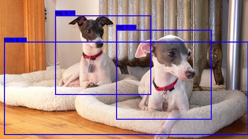
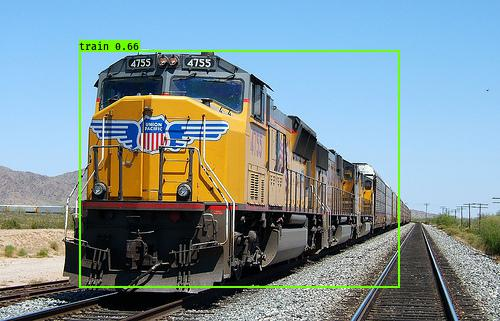
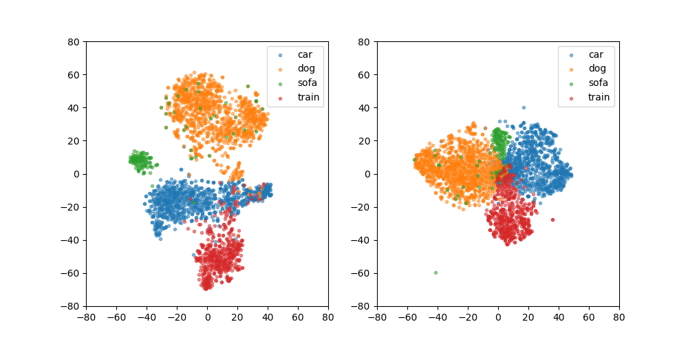

# Zero-Shot-Detection

## Introduction

A Keras implementation of Zero-Shot Detection Model based on YOLOv3 (Tensorflow backend),
referring to [keras-yolo3](https://github.com/qqwweee/keras-yolo3).

- ### Object Detection

    Object detection is a computer vision task that deals with detecting instances of
    semantic objects of a certain class (such as humans, buildings or cars) in digital
    images and videos, if present, to return the spatial location and extent of each
    object instance, e.g. via a bounding box. 

- ### Zero-Shot Learning

    Zero-shot learning (ZSL) aims to minimize the annotation requirements by enabling
    recognition of unseen classes, i.e. those with no training examples. This is achieved
    by transferring knowledge from seen to unseen classes by means of auxiliary data,
    typically obtained easily from textual sources.

- ### Zero-Shot Detection

    The existing ZSL approaches predominantly focus on classification problems. While
    zero-shot object detection (ZSD) task aims to recognize and localize instances of
    object classes with no training examples, purely based on auxiliary information that
    describes the class characteristics. We apply the mainstream ZSL approach on the
    famous [YOLO](https://arxiv.org/abs/1506.02640) detection model to achieve the transfer
    ability. As follows, the classes **dog**, **sofa** and **train** are not seen during
    training stage, but we are still able to detect them with our model.
    
      
    

---

## Results on PASCAL VOC

- ### Settings

    1. We split **16 / 4** of total 20 VOC classes as seen/unseen classes. We guarantee that
    there must be at least one category in seen classes that are semantically similar to
    any unseen classes. Unseen classes are as follows.
    
    2. Proved by experiments, we choose glove embedding to best represent each class 
    semantics. VOC class GloVe embedding are extracted in `data/glove_embedding.npy`. 
    (Later, we try class attribute vectors provided by [aPascal](http://vision.cs.uiuc.edu/attributes/) 
    and receive better performance. See attributes in `data` directory.)
    
    3. We apply basic ZSL method in the YOLO model, referring from the 2015 NIPS paper
     "[An embarrassingly simple approach to zero-shot learning](https://dl.acm.org/citation.cfm?id=3045347)".
     
    4. We provide some self-made modules in the objectness proposal brance, to better
    detect unseen object and improve the localization and recognition results.

- ### MAP of Unseen Classes
    
    U2U mAP for VOC (embedding):
    
    |   car  |   dog  |  sofa  | train  |   mAP  |
    |:------:|:------:|:------:|:------:|:------:|
    | 12.84% | 93.48% | 55.93% | 53.28% | 53.88% |
    
    U2U mAP for VOC (attribute):
    
    |   car  |   dog  |  sofa  | train  |   mAP  |
    |:------:|:------:|:------:|:------:|:------:|
    | 20.84% | 94.83% | 57.54% | 61.13% | 58.60% |

- ### Feature Exaction

    From current detection mAP of ZSD model, it has not achieved the most desirable 
    result as we expected. It is possible that nnsatisfactory feature extraction of
    one-stage model contributes to the problem. For further research, we would like to
    employ the two-stage models, such as [Faster RCNN](https://arxiv.org/abs/1506.01497),
    which contains a Region Proposal Network (RPN) to generate coarse regions and
    re-sample from the feature map.
    
    For the sake of simplicity, we cluster object feature map extracted by resnet50 in 
    Faster RCNN and the grid feature used in YOLO, with T-SNE tools.  
    The visualization is as shown below:
      
    
    Left is FRCNN features and right is YOLO features. Apparently the feature are more
    clear for classification in two-stage models. We consider methods in the two-stage
    models in the future for better performance.
    
- ### Feature Resampling
    
    We finetune the zero-shot yolo model to obtain better embedding prediction by adding
    a feature resampling layer, RoIAlign, proposed by [Mask R-CNN](https://arxiv.org/abs/1703.06870).
    We call it Zero-Shot YOLO+. Actually, the model is no longer a standard one-stage
    detector. It got reasonable results and stably increase the MAP on VOC dataset. The 
    improvement work of model architecture and parameters will be continued.

---

## Train and Evaluate

1. Generate your own annotation file and class names file.  
    One row for one image.  
    Row format: `image_file_path box1 box2 ... boxN`;  
    Box format: `x_min,y_min,x_max,y_max,class_id` (no space).  
    For VOC dataset, try `python voc_annotation.py`.  
    Here is an example:
    ```
    path/to/img1.jpg 50,100,150,200,0 30,50,200,120,3
    path/to/img2.jpg 120,300,250,600,2
    ...
    ```

2.  Download YOLOv3 weights from [YOLO website](http://pjreddie.com/darknet/yolo/). The
file model_data/yolo_weights.h5 is used to load pretrained weights.

3. Modify train.py and start training `python train.py`. Use your trained weights or
checkpoint weights in yolo.py. Remember to modify class path or anchor path.

4. Test ZSD model and evaluate the results using [mAP](https://github.com/Cartucho/mAP), 
or run the visualization demo.  
`python test.py  OR  python demo.py`.  
Test file is in the form: `path/to/img`, one row for one image.  

---

## Issues to know

1. The train and test environment is
    - Python 3.5.4
    - Keras 2.2.0
    - tensorflow 1.6.0

2. Default yolo anchors are used. If you use your own anchors, probably some changes are
needed.

3. The inference result is not totally the same as Darknet but the difference is small.

4. The speed is slower than Darknet. Replacing PIL with OpenCV may help a little.

5. Always load pretrained weights and freeze layers in the first stage of training. Or
try Darknet training. It's OK if there is a mismatch warning.

6. The training strategy is for reference only. Adjust it according to your dataset and
your goal. And add further strategy if needed.

7. For data and results analysis, you are recommended to run our scripts in the anaylsis 
directory as we provide.

8. Better semantic description can improve the results, like attributes.
